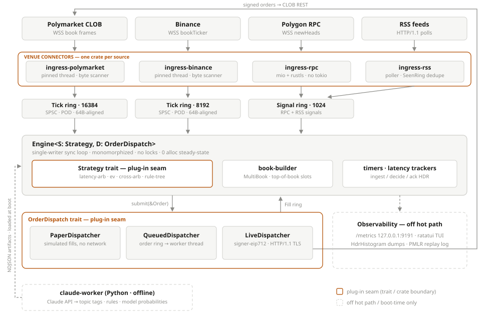

# Architecture

One-page orientation. `PLAN.md` at the repo root remains the authoritative deep-dive; this document exists so a reader can hold the whole system in their head before opening it.

## Data flow

Seven external sources (Polymarket CLOB WSS, Binance WSS, OKX WSS, Deribit JSON-RPC WSS, Hyperliquid WSS — HIP-4 outcome coins included — Polygon RPC WSS, and RSS over HTTP/1.1, dead-path pending Stage-2 removal) are each owned by a dedicated, core-pinned ingress thread. Every ingress crate follows the same shape: a `Driver` state machine over the `core-net::Transport` trait (mio + rustls, no tokio), handwritten WS/HTTP1 codecs, and a byte-scanner parser that emits venue-agnostic POD records — `Tick` (top-of-book) or `Signal` (event) — into a lock-free SPSC ring. At boot each venue's instrument universe is fetched over one-shot REST (`core-net::boot_http`, alloc-allowed boot path) and diffed against the configured symbols — coverage gauges, fail-fast in `--live`. The engine runs a single-writer synchronous loop on the main thread: it drains the rings, updates `book-builder::MultiBook`, and invokes the strategy's callbacks. Orders leave through the dispatcher, are EIP-712-signed by `signer-eip712` (mlock'd key, zeroized on drop), zero-alloc JSON-encoded, and POSTed to the CLOB over HTTP/1.1 + rustls. Fills return through the Fill ring. Alongside the ring push, every ingress thread writes PMLR replay capture (per-venue tick/event/signal logs + an optional bounded raw-payload tap) into `<MULTIVENUE_LOG_DIR>/run-<ns>/` — the offline dataset that `multivenue-engine audit-replay` judges and Stage-2's research loop consumes. The steady-state hot path performs zero heap allocations — capture included — enforced by `core-alloc::CountingAllocator` assertions in `crates/bench`.

## Extension seams

The platform has three deliberate plug-in points, marked in the diagram:

**Strategies — `strategy-core::Strategy` (trait seam).** Callbacks `on_start` (the only place allocation is permitted), `on_tick`, `on_signal`, `on_fill`, `on_timer`/`timer_period_ns`, `on_stop`, all generic over `Ctx` and monomorphized via `Engine<S: Strategy, D: OrderDispatch>` — no dynamic dispatch. The `StrategyCounters` supertrait wires per-strategy metrics for free; `CooldownGate`, `SymbolPairTable`, and the artifact tables cover shared machinery. Adding a strategy = a new crate implementing the trait, a `--strategy` match arm in `crates/cli`, and one zero-alloc assertion. Four in-tree strategies (latency-arb, ev, cross-arb, rule-tree) prove the seam.

**Market-data connectors — the ingress template (crate seam).** There is intentionally no `dyn Connector` trait; the contract is the `Tick`/`Signal` POD layout plus the shared `Transport`/codec/ring primitives. A new venue (Hyperliquid, OKX, Deribit, ...) is a new `ingress-<venue>` crate cloned from the `ingress-binance` shape: subscribe protocol + parser are the only venue-specific parts — all three shipped in Phase 8b–8d and are live-verified. Since Phase 8a the engine fans in over **lane arrays** — five tick lanes and four fill lanes indexed by `VenueId` — so adding a venue is mechanical (fill the lane, no engine surgery); `Tick`/`Order` carry an explicit venue byte and `SymbolId` is venue-namespaced (bits 31..24). Shared glue lifted into `core-net` (`IoBuf`, subscribe/pending tables, keepalive scheduling, capped-exponential backoff) and `core-metrics::IngressStatus` (per-thread state + §6.4 loss counters) keeps new run loops thin. Phase 8e added two more template obligations per venue: a boot-time REST `discovery` module (fixed-cap instrument table, coverage audit) and a monomorphized `Capture` sink threaded through the run loop (`core_types::Capture` → `core_io::PmlrCapture`) so every parsed slot reaches the replay logs.

**Execution — `OrderDispatch` (trait seam).** `submit`/`try_next_fill`/`stats`, proven by three impls: `PaperDispatcher` (simulated), `QueuedDispatcher` (SPSC order ring + worker thread), `LiveDispatcher` (signer + TLS). A new execution venue implements this trait in its own dispatcher crate; the `Order` type, signer, and encoder are Polymarket-specific today, so per-venue auth/encoding is real work behind a clean interface.

## Claude in the loop — always off the hot path

`claude-worker/` (Python, full-`import`-only) calls the Claude API offline and emits NDJSON artifacts: topic tags, trading rules, model probabilities. The engine consumes them as data, never as calls: `research-artifacts` loads tables at boot (this is how `ev` gets model probabilities and `rule-tree` gets its rules). For intraday refresh, the pattern is a small ingress thread tailing the worker's output into the Signal ring — Claude's opinion arrives as just another slow data feed.
